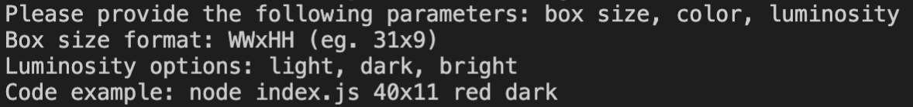
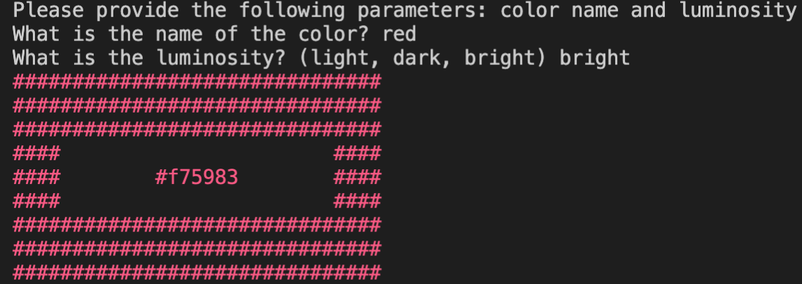
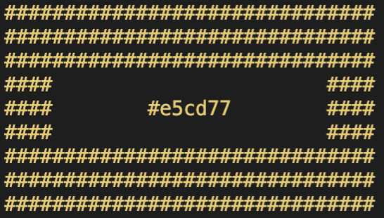
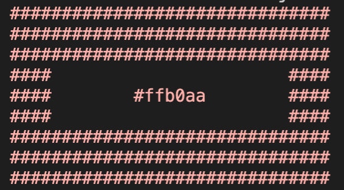
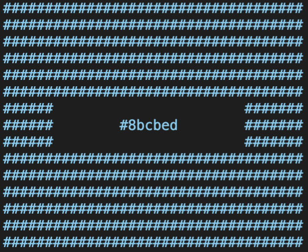

# NodeJS Random Color Generator

A simple program in NodeJS generating a block with a random color

## Installation

Use the package manager [yarn](https://yarnpkg.com/) to install the dependencies.

```bash
yarn install
```

## Usage

```
node index.js help
```

Provides additional information about the usage of the application.



```
node index.js ask
```

This will prompt you for the name and the luminosity of the color and print you a block with those parameters in mind.



```
node index.js
```

If you do not provide any additional input, it will print a block with a random color and luminosity.



```
node index.js red light
```

This will print a block with default sizes (31x9) and with the provided color and luminosity.



```
node index.js 36x15 blue light
```

This will print a block with the size of 36x15 and a light blue color.


